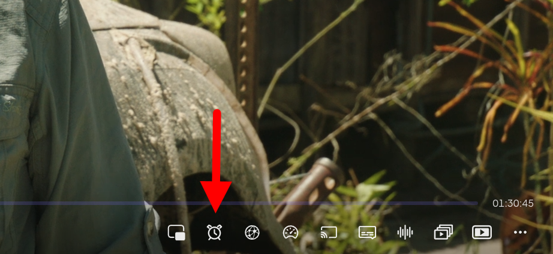
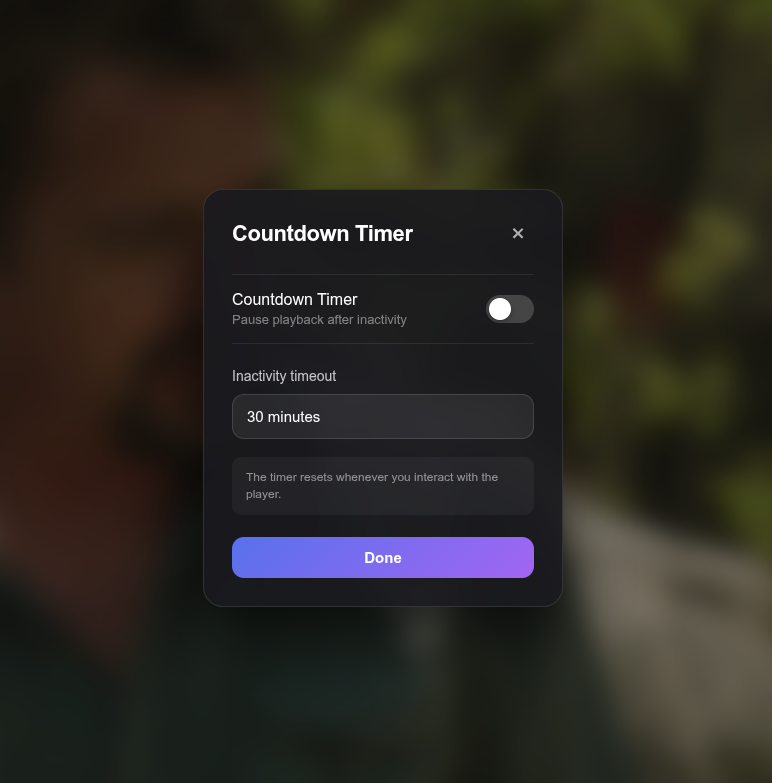

# Countdown Timer for Stremio Enhanced

A Stremio Enhanced plugin that automatically monitors your activity while watching. After a customizable period of inactivity, it pauses playback and asks if you're still watching.
If there is no response after 2 minutes, the plugin automatically exits the player.

  

## Preview

  

## Features

- ⏱️ Countdown timer button integrated into the Stremio player
- ⚙️ Configurable inactivity timeout in minutes (5, 10, 15, 20, 30, 45, 60, 90, 120)
- 🔘 Enable/disable toggle
- 💾 Settings are saved between sessions
- ▶️ Automatically pauses playback after inactivity
- ❓ Shows an "Are you still watching?" prompt
- 🚪 Exits the player if there is no response after 2 minutes

The timer only runs while video playback is active. User interaction with the player resets the inactivity timer.

  

## Installation

  There are two ways to install the Countdown Timer plugin:
  
1. Via Stremio Enhanced Marketplace (Recommended)

    - Open the Stremio Enhanced Community Marketplace (Settings → Scroll to the bottom)
    - Search for Countdown Timer
    - Click Install
    - Enable it and restart Stremio to apply changes.

2. Manual Installation

    - Download `countdown-timer.plugin.js` from the [latest release](https://github.com/JackVonDanger/stremio-countdown-timer/releases/latest).
    - Drag and drop it into your local Stremio Enhanced plugins folder.
    - Enable it and restart Stremio to apply changes.

  

## License

This project is licensed under the [MIT License](LICENSE).
